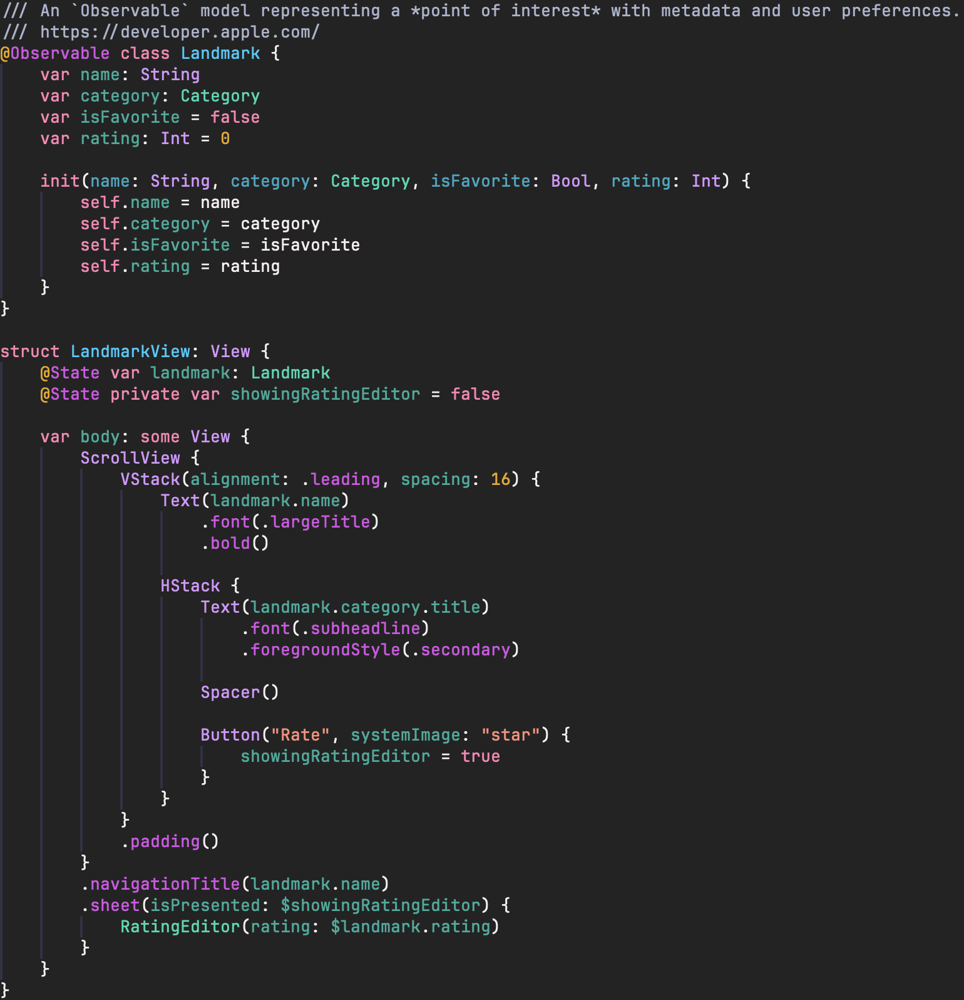
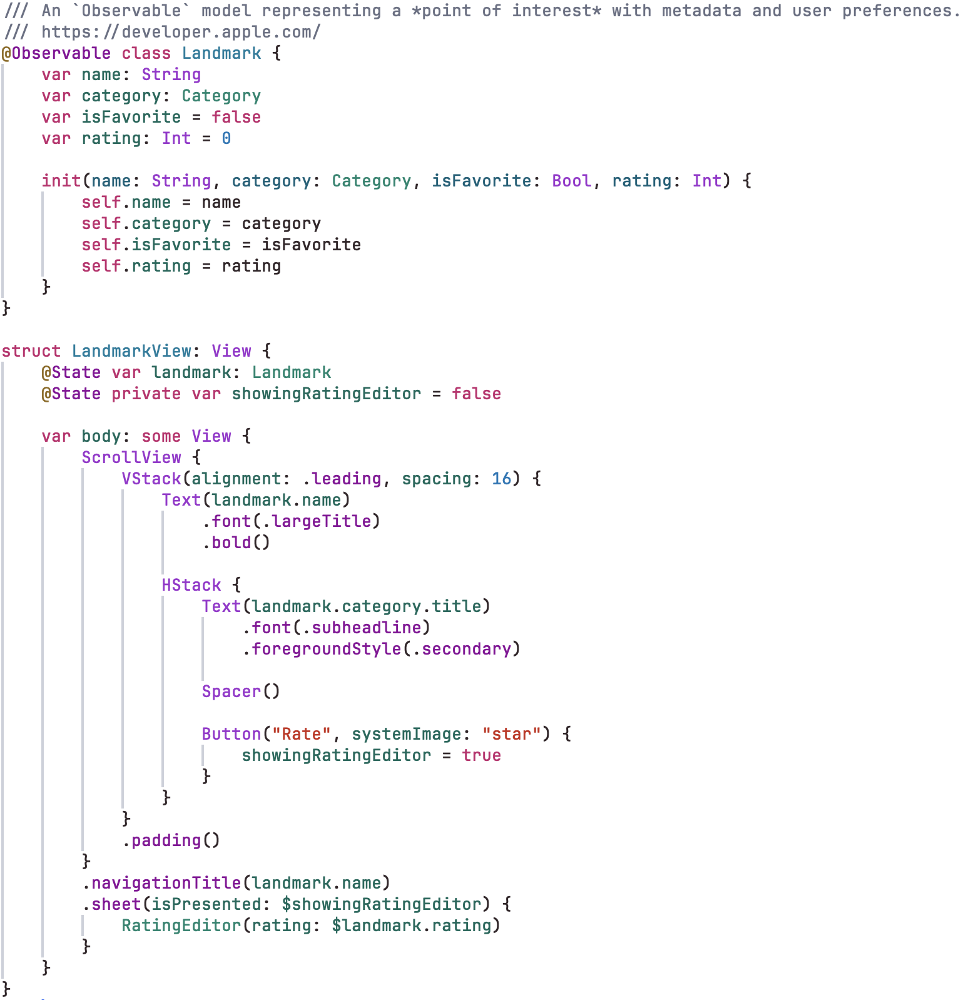
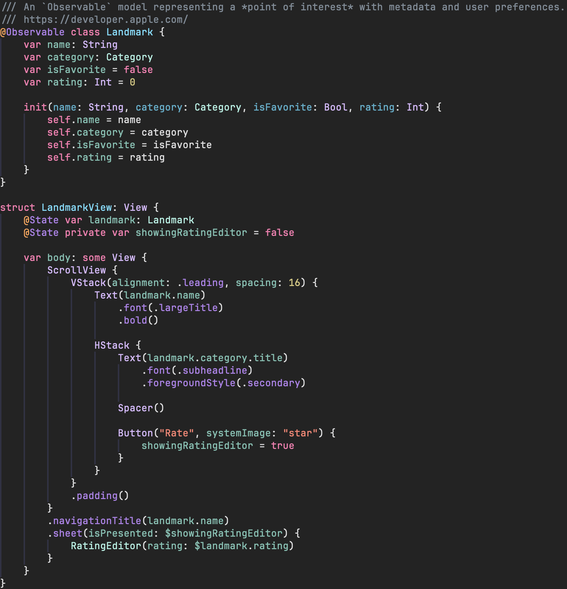
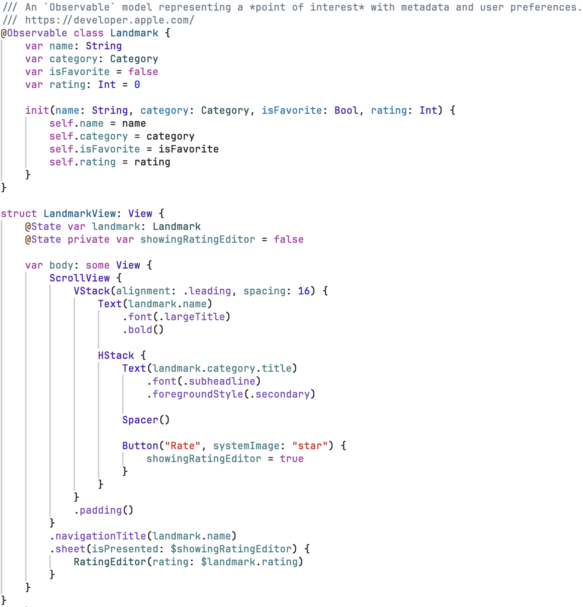

# xcode-colors.nvim

Xcode syntax colors for **Swift**, in Neovim.

This is **not a full colorscheme**. It only recolors Swift syntax, layered on top of whatever colorscheme you already run.

<p align="center">
  
</p>

## Requirements

- Neovim 0.11+
- The `swift` Treesitter parser
- `sourcekit-lsp` attached to your Swift buffers. Optional, but required to get full Xcode colors behavior.

Run `:checkhealth xcode-colors` to verify.

## Install

**vim.pack**

```lua
vim.pack.add { 'https://github.com/reevn/xcode-colors.nvim' }
require('xcode-colors').setup()
```

**lazy.nvim**

```lua
{
  'reevn/xcode-colors.nvim',
  ft = 'swift',
  opts = {},
}
```

## Configuration

Defaults:

```lua
require('xcode-colors').setup {
  -- Base palette preset (see below).
  preset = 'xcode27-dark',
  -- Per-color overrides layered on top of the preset (any subset of roles).
  -- Roles: plain, comment, keyword, string, number, preprocessor, type_decl,
  -- member_decl, project_type, project_member, other_type, other_member.
  palette = {},
  -- Enable the sourcekit-lsp semantic-token layer.
  lsp = true,
  -- LSP client name to treat as sourcekit.
  sourcekit_client = 'sourcekit',
}
```

### Presets

<!-- GALLERY: one screenshot per preset, ideally the same Swift snippet each
     time so colors compare directly. Save them under assets/ as named below. -->

|              | Dark                                                          | Light                                                            |
| ------------ | ------------------------------------------------------------- | --------------------------------------------------------------- |
| **Xcode 27** |  <br> `xcode27-dark`  |  <br> `xcode27-light` |
| **Xcode 26** |  <br> `xcode26-dark`  |  <br> `xcode26-light` |

Example: pick a preset and retint one color on top of it:

```lua
require('xcode-colors').setup {
  preset = 'xcode27-dark',
  palette = { keyword = '#ff5fa2' },
}
```

Switch presets at runtime with `:XcodeColorsPreset {name}`, or
`require('xcode-colors').set_preset(name)` from Lua. Either keeps your `palette`
overrides. Handy for following a light/dark change.

## Tuning: `inspect()`

Put the cursor on any symbol and run `:lua require('xcode-colors').inspect()` to print the sourcekit
semantic token and the color role it maps to.

## Known limitations

These depend on information sourcekit-lsp does not provide, so they can't be
matched reliably:

- **Top-level variable *uses*** get the same token as local variable uses, so they stay plain.
